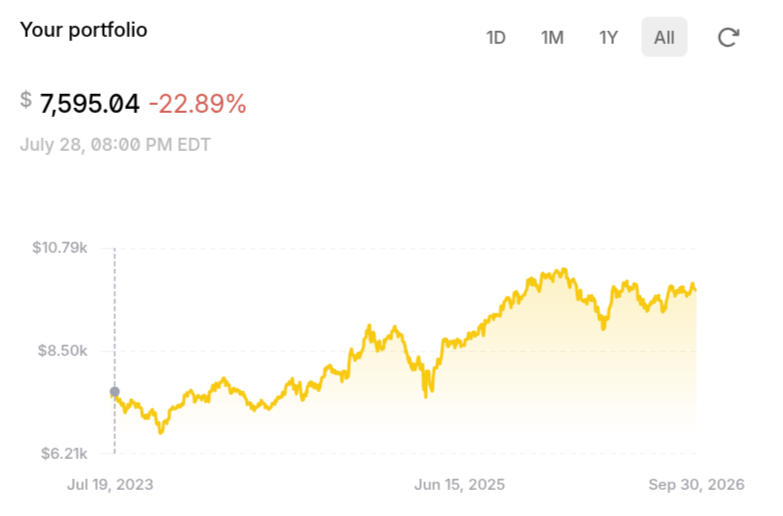
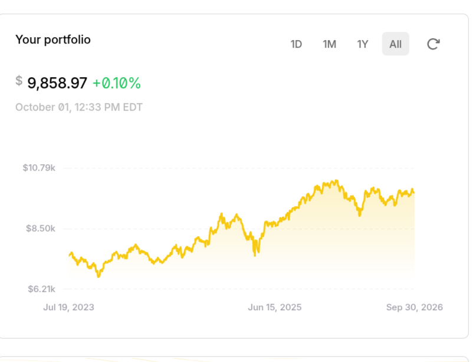

# Paper Trading Lab

> **Note:** This is a public copy of a private repository, which I still run day to day on a schedule. The commit history is preserved. Pull request history and credentials have been removed.

This is a small project I wrote as a learning exercise. It paper-trades automatically on a schedule using GitHub Actions and the Alpaca and Gemini sandbox APIs. It has never been used with a live account.

## What it does

- **Stock bot** (`AgressiveStockStrat/`): every weekday it pulls public US Senate stock-trade disclosures, picks the stocks senators are net buying, and rebalances an Alpaca paper portfolio while holding back a cash reserve.
- **P&L reporting** (`calculate_pnl.py`): a matrix workflow that reports positions and profit/loss for each portfolio configuration.
- **Crypto bots** (`BTCParty/`): experiments against the Alpaca crypto and Gemini sandbox APIs.
- **Workflows** (`.github/workflows/`): scheduled and manually triggered jobs. Separate portfolios run as GitHub Environments, each with its own secrets.

## A note on the strategy

The trading logic is deliberately simple, and frankly it's a guess. The point of the project is the engineering: scheduled execution, broker API integration, secrets handling, and reporting. It is not trying to find an edge.

## Results (paper account)

The bot has been running unattended on its GitHub Actions schedule since July 2023.

| July 28, 2023 | October 1, 2026 |
|---|---|
|  |  |
| **$7,595.04** | **$9,858.97** |

That's roughly **+30% over about three years** of paper trading. It's a paper account and the strategy is simple, so don't read much into the number. What matters more is that the system has kept running reliably for three years without anyone touching it.
Good ole Github Actions!

## Running it

Credentials come only from environment variables, which in this setup are GitHub Actions secrets:

```
ALPACA_API_KEY
ALPACA_API_SECRET
ALPACA_API_URL      # defaults to https://paper-api.alpaca.markets
GEMINI_API_KEY      # sandbox
GEMINI_API_SECRET   # sandbox
```

```bash
pip install -r AgressiveStockStrat/requirements.txt
python AgressiveStockStrat/alpaca_trade.py
```

Actions are disabled on this copy, so the scheduled workflows don't run here.

## License

MIT, but seriously, don't use this with real money.
